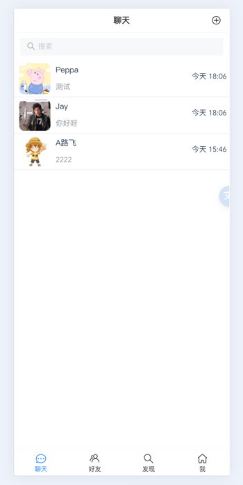
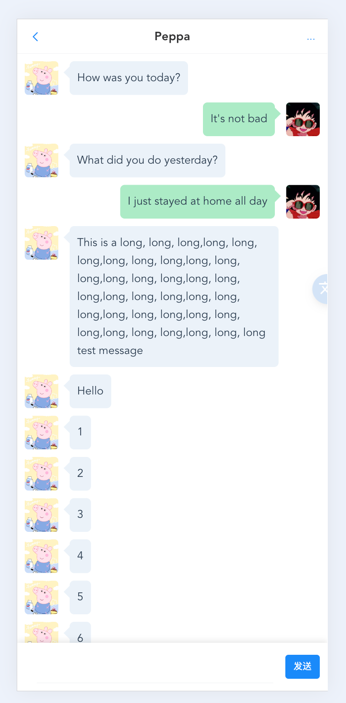
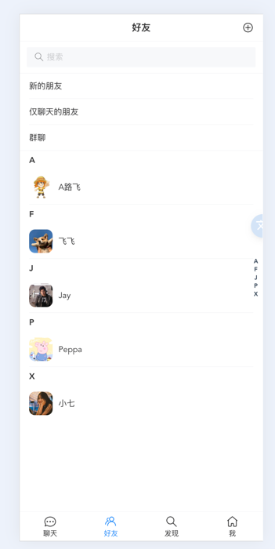
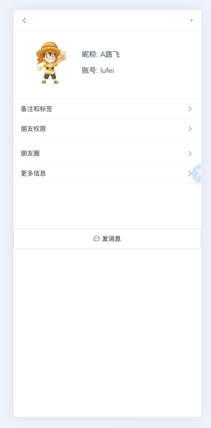
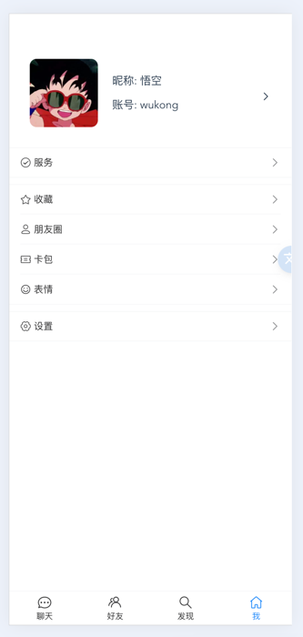

# 即时消息演示

[中文说明](./README-zh.md) | [English](./README.md)

### 介绍

> 这是一个使用WebSocket技术的半成品的演示仓库，但是基本功能已经完成。

[前端仓库地址](https://github.com/wxy2077/im_chat)

### UI 截图

点击展开

  

 

### 技术栈
#### 后端
- Golang + Gin
- MySQL5.7 + Gorm
- Jaeger
- Docker
#### 前端
- Vue3 + TypeScript
- Pinia
- VantUI
- axios