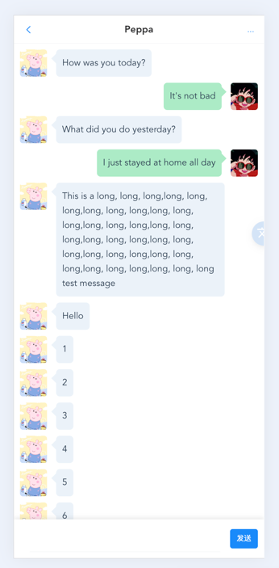

# IM Chat Demo

[中文说明](./README-zh.md) | [English](./README.md)

### Introduce

> This is a semi-finished demonstration repository that utilizes WebSocket technology, but the basic functionalities have been completed.

[Frontend Code Repository](https://github.com/wxy2077/im_chat)

### UI screenshot

Click to expand to view

   

 

### Technology stack

#### backend
- Golang + Gin
- MySQL5.7 + Gorm
- Jaeger
- Docker
#### frontend
- Vue3 + TypeScript
- Pinia
- VantUI
- axios